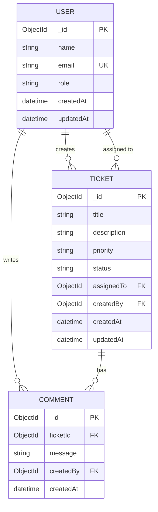

# Data Model

## Entity Relationship Diagram



## Collections

### User

**Collection:** `users`

| Field | Type | Constraints | Description |
|-------|------|-------------|-------------|
| `_id` | ObjectId | PK, auto | Unique identifier |
| `name` | String | required, max 100, trim | Display name |
| `email` | String | required, unique, lowercase, email format | Contact email |
| `role` | String | enum: `admin`, `agent`, `user`, default: `user` | User role |
| `createdAt` | Date | auto | Record creation timestamp |
| `updatedAt` | Date | auto | Last update timestamp |

**Indexes:**
- `email` — unique

**Seed data (5 users):**

| Name | Email | Role |
|------|-------|------|
| Alice Admin | alice@stms.com | admin |
| Bob Agent | bob@stms.com | agent |
| Carol Agent | carol@stms.com | agent |
| Dave User | dave@stms.com | user |
| Eve User | eve@stms.com | user |

---

### Ticket

**Collection:** `tickets`

| Field | Type | Constraints | Description |
|-------|------|-------------|-------------|
| `_id` | ObjectId | PK, auto | Unique identifier |
| `title` | String | required, max 200, trim | Ticket subject |
| `description` | String | required, max 5000, trim | Detailed issue description |
| `priority` | String | enum: `Low`, `Medium`, `High`, `Critical`, default: `Medium` | Urgency level |
| `status` | String | enum: see below, default: `Open` | Workflow state |
| `assignedTo` | ObjectId | ref: User, nullable | Assigned agent |
| `createdBy` | ObjectId | ref: User, required | Ticket creator |
| `createdAt` | Date | auto | Creation timestamp |
| `updatedAt` | Date | auto | Last modification timestamp |

**Status enum values:**
- `Open`
- `In Progress`
- `Resolved`
- `Closed`
- `Cancelled`

**Indexes:**
- Text index on `title` + `description` (for keyword search)

**Seed data (6 tickets):**

| Title | Priority | Status | Created By | Assigned To |
|-------|----------|--------|------------|-------------|
| Cannot login to dashboard | High | Open | Dave User | Bob Agent |
| Email notifications not working | Critical | In Progress | Eve User | Carol Agent |
| Feature request: Dark mode | Low | Open | Dave User | — |
| Slow page load on reports | Medium | Resolved | Eve User | Bob Agent |
| Export to CSV broken | High | Closed | Dave User | Carol Agent |
| Duplicate ticket creation | Medium | Cancelled | Alice Admin | — |

---

### Comment

**Collection:** `comments`

| Field | Type | Constraints | Description |
|-------|------|-------------|-------------|
| `_id` | ObjectId | PK, auto | Unique identifier |
| `ticketId` | ObjectId | ref: Ticket, required | Parent ticket |
| `message` | String | required, max 2000, trim | Comment text |
| `createdBy` | ObjectId | ref: User, required | Comment author |
| `createdAt` | Date | auto | Creation timestamp |

**Notes:**
- No `updatedAt` — comments are immutable after creation
- Cascade deleted when parent ticket is deleted (application-level)

**Seed data (4 comments):**

| Ticket | Author | Message |
|--------|--------|---------|
| Cannot login to dashboard | Bob Agent | Verified the issue. Checking auth logs. |
| Cannot login to dashboard | Dave User | Started after Monday deployment. |
| Email notifications not working | Carol Agent | SMTP credentials rotated. Updating config. |
| Slow page load on reports | Bob Agent | Added DB indexes. Load time reduced to 2s. |

---

## Relationships

| From | To | Cardinality | Notes |
|------|----|-------------|-------|
| User | Ticket (createdBy) | 1:N | Every ticket has one creator |
| User | Ticket (assignedTo) | 1:N | Optional — ticket may be unassigned |
| User | Comment | 1:N | Every comment has one author |
| Ticket | Comment | 1:N | Ticket can have many comments |

## Status State Machine

```
         ┌─────────────┐
         │    Open     │
         └──────┬──────┘
                │
       ┌────────┼────────┐
       ▼                 ▼
┌─────────────┐   ┌─────────────┐
│ In Progress │   │  Cancelled  │ (terminal)
└──────┬──────┘   └─────────────┘
       │
  ┌────┼────┐
  ▼         ▼
┌────────┐ ┌─────────────┐
│Resolved│ │  Cancelled  │ (terminal)
└───┬────┘ └─────────────┘
    ▼
┌────────┐
│ Closed │ (terminal)
└────────┘
```

## Validation Summary

| Entity | Server Validation | DB Validation |
|--------|------------------|---------------|
| User | express-validator (on create if exposed) | Mongoose schema |
| Ticket | express-validator on all write endpoints | Mongoose schema + enum |
| Comment | express-validator on create | Mongoose schema |

## Database Configuration

```
MONGODB_URI=mongodb://localhost:27017/stms
```

Database name: `stms`

Seed command: `cd server && npm run seed`
