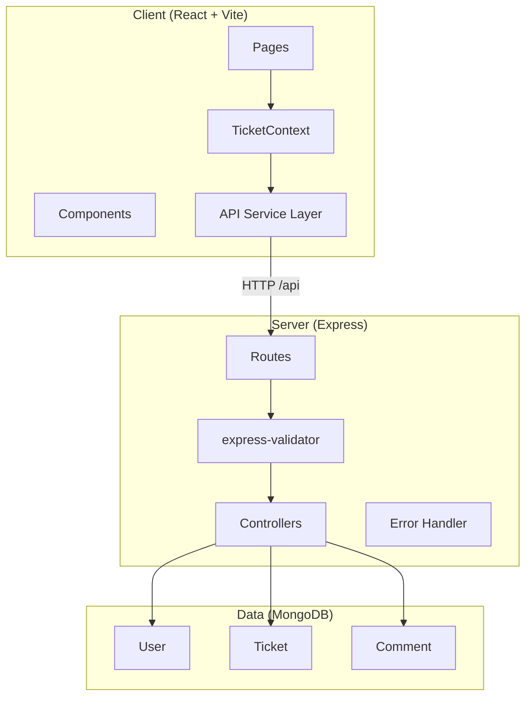
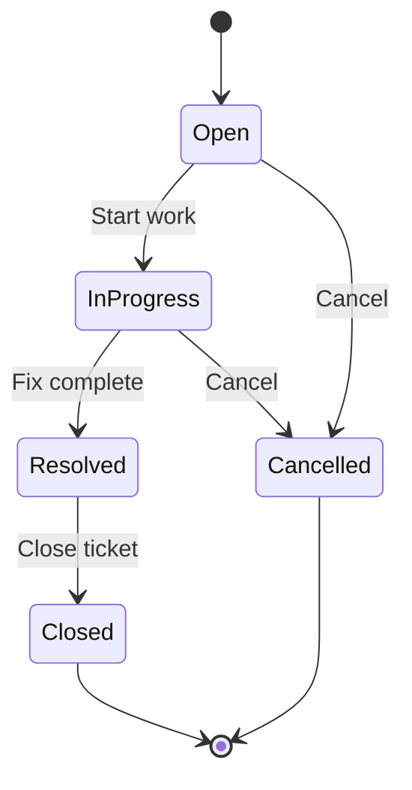

# Design Notes

## Architecture Overview

STMS follows a classic three-tier MERN architecture with clear separation between presentation, API, and data layers.



## Key Design Decisions

### 1. Dedicated Status Endpoint

**Decision:** Status changes use `PATCH /api/tickets/:id/status`, not the general `PUT` endpoint.

**Rationale:**
- Separates field updates from workflow transitions
- Allows distinct validation rules per operation
- Prevents accidental status changes when editing title/description
- Makes status transition logic testable in isolation

### 2. Status Transition Utility

**Decision:** Business rules live in `server/src/utils/statusTransitions.js`, shared by controller and tests.

**Rationale:**
- Single source of truth for allowed transitions
- Controller stays thin — delegates to utility functions
- Frontend mirrors the same rules in `client/src/utils/constants.js` for UI button visibility

### 3. No Authentication (MVP)

**Decision:** Users are seed data; no login flow.

**Rationale:**
- Reduces scope for initial delivery
- Frontend defaults to first agent user for `createdBy` on actions
- API accepts `createdBy` in request body
- Authentication can be added as a layer without changing core models

### 4. React Context + useReducer

**Decision:** State management via Context API with `useReducer`, no Redux/Zustand.

**Rationale:**
- Meets project requirement
- Sufficient for current scope (tickets, users, filters, messages)
- Avoids additional dependency
- Centralizes API calls and loading/error state

### 5. Axios API Service Layer

**Decision:** All HTTP calls go through `client/src/services/api.js`.

**Rationale:**
- Single place for base URL, headers, and error handling
- `cleanParams()` strips empty filters before requests
- Response interceptor normalizes error messages for UI

### 6. MongoDB Text Index for Search

**Decision:** Text index on `title` and `description` fields.

**Rationale:**
- Native MongoDB `$text` search — no external search engine needed
- Adequate for MVP keyword search
- Index defined in Ticket schema

### 7. Centralized Error Handling

**Decision:** Custom `AppError` class + global `errorHandler` middleware.

**Rationale:**
- Consistent `{ success: false, message }` response format
- Handles Mongoose validation, cast, and duplicate key errors
- Controllers use `next(error)` pattern — no try/catch response formatting

### 8. Cascade Delete for Comments

**Decision:** Deleting a ticket also deletes its comments via `Comment.deleteMany()`.

**Rationale:**
- Comments have no meaning without parent ticket
- Prevents orphaned records
- Explicit in controller, not DB-level cascade (simpler for MVP)

## Folder Structure Rationale

```
server/src/
├── config/       # External service config (DB, Swagger)
├── controllers/  # Request handlers — thin, delegate to models/utils
├── middleware/   # Cross-cutting: validation, error handling
├── models/       # Mongoose schemas only
├── routes/       # Route definitions + Swagger annotations
├── seed/         # Database seeding script
└── utils/        # Pure business logic (status transitions)

client/src/
├── components/   # Presentational, reusable UI
├── context/      # Global state (TicketContext)
├── pages/        # Route-level components
├── services/     # HTTP client (Axios)
└── utils/        # Frontend constants mirroring backend rules
```

## API Response Conventions

**Success:**
```json
{
  "success": true,
  "data": { ... }
}
```

**Error:**
```json
{
  "success": false,
  "message": "Human-readable error description"
}
```

**List with pagination:**
```json
{
  "success": true,
  "data": [ ... ],
  "pagination": {
    "total": 6,
    "page": 1,
    "limit": 20,
    "pages": 1
  }
}
```

## Frontend Component Design

| Component | Responsibility |
|-----------|---------------|
| `Layout` | App shell with navigation header |
| `TicketFilters` | Search input + status dropdown |
| `TicketCard` / `TicketRow` | Ticket list item |
| `TicketForm` | Shared create/edit form |
| `Badge` | Status and priority color badges |
| `Alert` | Success/error message banner |
| `Spinner` | Loading indicator |

## Status Workflow Diagram



## Trade-offs

| Choice | Benefit | Cost |
|--------|---------|------|
| No auth | Faster delivery | Not production-ready for multi-user |
| Context API vs Redux | Simpler, fewer deps | May not scale for complex state |
| Text index search | No extra infrastructure | Less powerful than Elasticsearch |
| In-memory DB for tests | Fast, no external deps | Slight divergence from production MongoDB |
