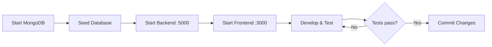

# Tool Workflow

## Development Environment

| Tool | Version | Purpose |
|------|---------|---------|
| Node.js | >= 18 | Runtime for client and server |
| npm | >= 9 | Package management |
| MongoDB | >= 6 | Primary database |
| Git | — | Version control |
| VS Code / Cursor | — | IDE |

## Project Commands

### Server (`server/`)

```bash
npm install        # Install dependencies
npm run dev        # Start dev server with nodemon (port 5000)
npm start          # Production start
npm run seed       # Populate MongoDB with sample data
npm test           # Run Jest integration tests
```

### Client (`client/`)

```bash
npm install        # Install dependencies
npm run dev        # Start Vite dev server (port 3000)
npm run build      # Production build to dist/
npm run preview    # Preview production build
```

## Local Development Workflow



### Step-by-step

1. **Start MongoDB**
   ```bash
   sudo systemctl start mongod
   # or: docker start mongodb
   ```

2. **Configure environment**
   ```bash
   cp server/.env.example server/.env
   cp client/.env.example client/.env   # optional
   ```

3. **Seed data** (first run or after DB reset)
   ```bash
   cd server && npm run seed
   ```

4. **Run both servers** in separate terminals
   ```bash
   cd server && npm run dev
   cd client && npm run dev
   ```

5. **Verify**
   - Health: `curl http://localhost:5000/api/health`
   - Users: `curl http://localhost:5000/api/users`
   - UI: open http://localhost:3000

## API Proxy

During development, Vite proxies `/api/*` requests to `http://localhost:5000`. The frontend Axios client uses `baseURL: '/api'`, so no CORS configuration is needed in the browser.

If port 3000 is occupied, Vite auto-selects the next port (e.g. 3001). The proxy still targets port 5000.

## Testing Workflow

```bash
cd server
npm test
```

- Uses `mongodb-memory-server` — no external MongoDB required for tests
- Runs in-band (`--runInBand`) to avoid race conditions
- 20 integration tests covering status transitions, CRUD, search, and comments

## API Documentation

Swagger UI is available at:

```
http://localhost:5000/api/docs
```

Generated from JSDoc annotations in route files via `swagger-jsdoc` and `swagger-ui-express`.

## Git Workflow

Recommended branch naming:

```
cursor/<ticket>-<summary>
main          # protected — no direct pushes
```

Commit message style:

```
feat: add ticket status transition validation
fix: treat empty status filter as "all tickets"
test: add integration tests for invalid transitions
docs: add api-contract and data-model
```

## Troubleshooting

| Symptom | Cause | Fix |
|---------|-------|-----|
| `ECONNREFUSED 127.0.0.1:5000` | Backend not running | `cd server && npm run dev` |
| `Invalid status filter` on dashboard | Empty status sent as query param | Fixed — empty params are stripped |
| MongoDB connection error | MongoDB not started | Start MongoDB service |
| Port 3000 in use | Another process on 3000 | Vite uses 3001 automatically |
