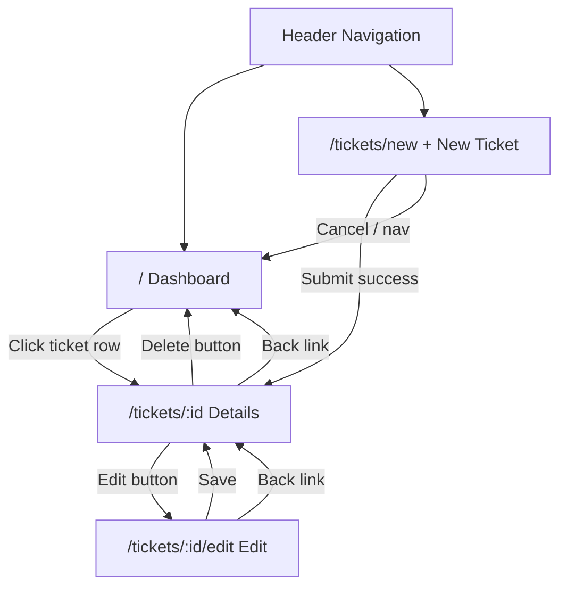
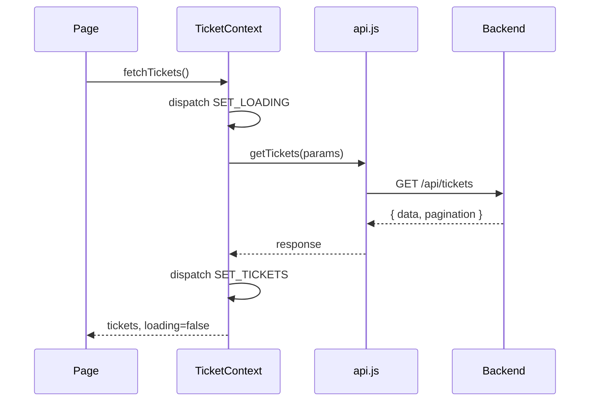

# UI Flow

## Route Map

| Route | Page | Description |
|-------|------|-------------|
| `/` | Dashboard | Ticket list with search and filter |
| `/tickets/new` | Create Ticket | New ticket form |
| `/tickets/:id` | Ticket Details | View, comment, change status, delete |
| `/tickets/:id/edit` | Edit Ticket | Update ticket fields |

## Navigation Structure



## Screen Flows

### 1. Dashboard (`/`)

**On load:**
1. Fetch tickets (no status filter — all tickets)
2. Display ticket count in header
3. Show loading spinner during fetch

**User actions:**

| Action | Result |
|--------|--------|
| Type keyword + press Enter or click Search | Re-fetch tickets with `search` param |
| Select status from dropdown | Re-fetch tickets filtered by status |
| Select "All Statuses" | Re-fetch all tickets (no status filter) |
| Click ticket row | Navigate to `/tickets/:id` |
| Click "+ New Ticket" in header | Navigate to `/tickets/new` |

**UI states:**
- **Loading:** Centered spinner replaces ticket list
- **Empty (no tickets):** Empty state with "Create your first ticket" link
- **Empty (filtered):** "No tickets match your filters" message
- **Error:** Red alert banner with dismiss button
- **Success:** Green alert banner (e.g., after returning from delete)

---

### 2. Create Ticket (`/tickets/new`)

**On load:**
1. Fetch users list (for assignee dropdown)

**Form fields:**
- Title (required)
- Description (required)
- Priority (dropdown: Low, Medium, High, Critical)
- Assign To (dropdown: agents/admins + Unassigned)

**On submit:**
1. POST `/api/tickets` with `createdBy` set to current demo user
2. On success → redirect to `/tickets/:id`
3. On error → show error alert

---

### 3. Ticket Details (`/tickets/:id`)

**On load:**
1. Fetch ticket + comments
2. Fetch users (for context)

**Sections:**

1. **Header** — title, status badge, priority badge, Edit/Delete buttons
2. **Details card** — description, created by, assigned to, dates
3. **Status change** — buttons for valid next statuses only (hidden if terminal)
4. **Comments** — chronological list + add comment form

**User actions:**

| Action | Result |
|--------|--------|
| Click status button (e.g., "→ In Progress") | PATCH status, refresh ticket, show success |
| Submit comment | POST comment, append to list, clear form |
| Click Edit | Navigate to `/tickets/:id/edit` |
| Click Delete | Confirm dialog → DELETE ticket → redirect to `/` |
| Click "← Back to dashboard" | Navigate to `/` |

**Status buttons example (ticket is Open):**
```
Change Status
[ → In Progress ]  [ → Cancelled ]
```

---

### 4. Edit Ticket (`/tickets/:id/edit`)

**On load:**
1. Fetch ticket by ID
2. Fetch users list
3. Pre-fill form with current values

**On submit:**
1. PUT `/api/tickets/:id` (no status change)
2. On success → redirect to `/tickets/:id`
3. On error → show error alert

---

## Global UI Patterns

### Alert Messages

| Type | Color | Usage |
|------|-------|-------|
| Error | Red | API failures, validation errors |
| Success | Green | Ticket created, status changed, comment added |

Alerts are dismissible via × button.

### Badges

| Badge | Colors |
|-------|--------|
| Open | Blue |
| In Progress | Yellow |
| Resolved | Green |
| Closed | Gray |
| Cancelled | Red |
| Low priority | Gray |
| Medium priority | Blue |
| High priority | Orange |
| Critical priority | Red |

### Loading States

- Full-page spinner on initial data fetch
- Button text changes to "Saving..." / "Posting..." during submit
- Buttons disabled while request is in flight

### Responsive Behavior

- Single column on mobile
- Side-by-side filters on `sm+` breakpoint
- Ticket row stacks metadata vertically on small screens

## State Management Flow



## Demo User Behavior

Since there is no login, the frontend automatically selects the first `agent` user from the seed data as `currentUser`. This user is used as `createdBy` when creating tickets and comments.
